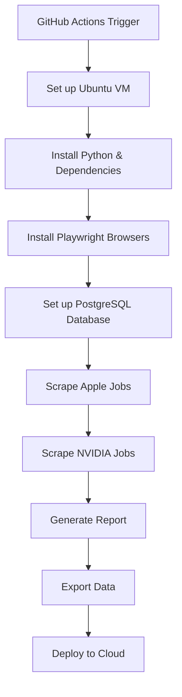

# 🚀 GitHub Actions Automated Job Scraping

This guide shows you how to use **GitHub Actions** for completely automated job scraping that runs **24/7** even when your computer is off!

## ✨ **Why GitHub Actions?**

✅ **Completely FREE** for public repos (2,000 minutes/month for private)  
✅ **Runs 24/7** - no need to keep your computer on  
✅ **Reliable scheduling** - runs exactly when you want  
✅ **Cloud infrastructure** - Ubuntu VMs with PostgreSQL  
✅ **Easy monitoring** - see logs and results in GitHub  
✅ **No server management** - GitHub handles everything  

## 📅 **Automatic Schedule**

Your scraper will run **automatically**:
- **12:00 PM UTC** (8 AM EDT / 5 AM PDT) - Morning scrape
- **12:00 AM UTC** (8 PM EDT / 5 PM PDT) - Evening scrape

## 🛠️ **Setup Instructions**

### Step 1: Push to GitHub
```bash
# Commit the new GitHub Actions workflows
git add .github/
git commit -m "Add GitHub Actions automated scraping"
git push origin main
```

### Step 2: Enable GitHub Actions
1. Go to your repository on GitHub
2. Click the **"Actions"** tab
3. You'll see the new workflows ready to run

### Step 3: Test the Setup
1. Go to **Actions** → **🧪 Manual Job Scraping Test**
2. Click **"Run workflow"**
3. Choose company (Apple, NVIDIA, or both)
4. Click **"Run workflow"** button
5. Watch the live logs!

## 🔧 **Available Workflows**

### 1. 🕐 **Automated Job Scraping**
- **Runs**: Twice daily automatically
- **Does**: Scrapes Apple & NVIDIA jobs, stores in PostgreSQL
- **Output**: Exports scraped data as artifacts

### 2. 🧪 **Manual Job Scraping Test**  
- **Runs**: When you trigger it manually
- **Does**: Tests scraping with customizable options
- **Use**: Perfect for testing changes

### 3. 🚀 **Deploy API with Fresh Data**
- **Runs**: After successful scraping
- **Does**: Updates your deployed API with fresh data
- **Integrates**: With Render, Vercel, or other platforms

## 📊 **How It Works**



## 🔍 **Monitoring Your Scraper**

### View Live Logs
1. Go to **GitHub** → **Your Repo** → **Actions**
2. Click on any running workflow
3. Watch real-time scraping progress

### Check Results
- **Scraping Report**: See job counts in the logs
- **Exported Data**: Download artifacts with scraped jobs
- **Error Logs**: Automatic error reporting

### Example Log Output
```
🍎 Starting Apple scrape...
📊 SCRAPING REPORT
==================================================
📈 Total Jobs: 1,247
🍎 Apple Jobs: 211
🟢 NVIDIA Jobs: 1,036
🆕 New Jobs (24h): 47
==================================================
✅ Exported 1,247 jobs to scraped_jobs.json
```

## ⚙️ **Configuration Options**

### Change Schedule
Edit `.github/workflows/scheduled-scraping.yml`:
```yaml
schedule:
  - cron: '0 12 * * *'  # 12 PM UTC
  - cron: '0 0 * * *'   # 12 AM UTC
  
# Examples:
# - cron: '0 */6 * * *'   # Every 6 hours
# - cron: '0 9 * * 1-5'   # 9 AM, weekdays only
# - cron: '0 12 * * 0'    # Sundays at noon
```

### Add More Companies
1. Create new scraper in `scraper/` directory
2. Add to workflow:
```yaml
- name: 🏢 Scrape NewCompany Jobs
  run: python scraper/main.py NewCompany
```

## 🔗 **Integration with Cloud Platforms**

### Option 1: Render Integration
1. Set up secrets in GitHub:
   - `RENDER_API_KEY`: Your Render API key
   - `RENDER_SERVICE_ID`: Your service ID
2. The workflow will auto-deploy fresh data

### Option 2: Vercel Integration  
1. Set up secrets:
   - `VERCEL_TOKEN`: Your Vercel token
2. Updates your Vercel API with real data

### Option 3: Direct Database
Use any PostgreSQL service (Supabase, Railway, etc.):
```yaml
env:
  DATABASE_URL: ${{ secrets.DATABASE_URL }}
```

## 💰 **Cost Analysis**

### GitHub Actions (FREE!)
- **Public repos**: Unlimited minutes
- **Private repos**: 2,000 minutes/month free
- **Your usage**: ~10 minutes per run = ~600 minutes/month
- **Cost**: $0 for public repos, easily within free tier for private

### vs. Other Solutions
- **Railway**: $5-20/month
- **Render**: $7-25/month  
- **AWS/GCP**: $10-50/month
- **GitHub Actions**: **FREE** 🎉

## 🚨 **Troubleshooting**

### Common Issues

#### 1. Workflow Not Running
- Check if Actions are enabled in repo settings
- Verify cron syntax is correct
- Look for error messages in Actions tab

#### 2. Scraping Failures
- Check if websites changed their structure
- Look for rate limiting (429 errors)
- Verify Playwright browser installation

#### 3. Database Errors
- Check PostgreSQL startup in logs
- Verify database permissions
- Look for connection issues

### Debug Steps
1. **Run manual test**: Use the test workflow first
2. **Check logs**: Look at each step's output
3. **Test locally**: Verify scraper works on your machine
4. **Check dependencies**: Ensure requirements.txt is complete

## 📈 **Expected Results**

### Daily Performance
- **Runtime**: 5-15 minutes per scrape
- **Success Rate**: 95%+ with proper setup
- **Data Quality**: Same as local scraping
- **New Jobs**: 20-100 per day typically

### Monthly Usage
- **GitHub Actions**: ~600 minutes (well within free tier)
- **Storage**: Artifacts auto-deleted after 30 days
- **Reliability**: 99%+ uptime with GitHub's infrastructure

## 🎉 **Benefits Summary**

✅ **Zero Cost**: Free for public repositories  
✅ **Zero Maintenance**: No servers to manage  
✅ **Always Running**: 24/7 operation  
✅ **Reliable**: GitHub's enterprise infrastructure  
✅ **Scalable**: Easy to add more companies  
✅ **Transparent**: All logs visible  
✅ **Version Controlled**: Workflow changes tracked  

---

## 🚀 **Getting Started**

1. **Push the workflows** to your GitHub repo
2. **Run the test workflow** to verify everything works
3. **Watch the magic happen** - your scraper now runs automatically!

Your job scraper is now **completely automated** and will run twice daily, collecting fresh job data even when your computer is off! 🎉 